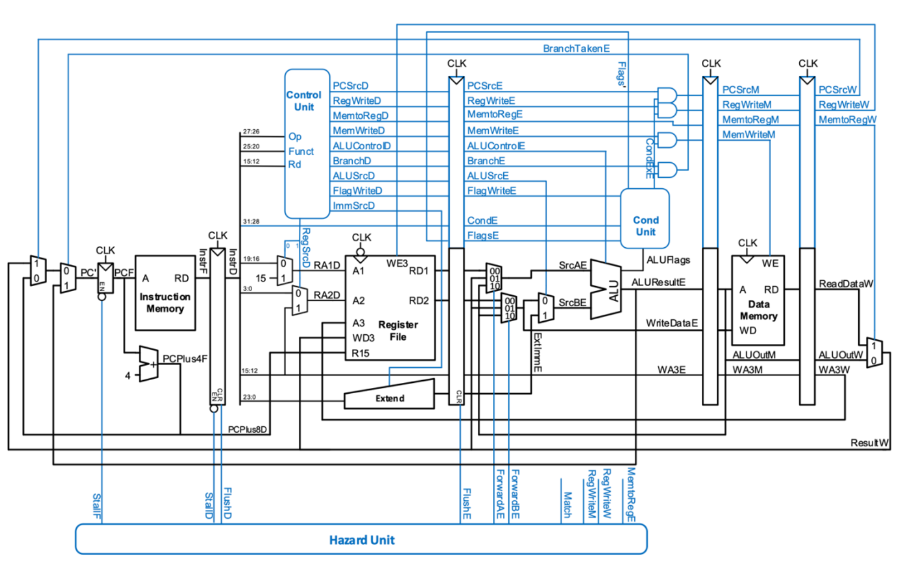
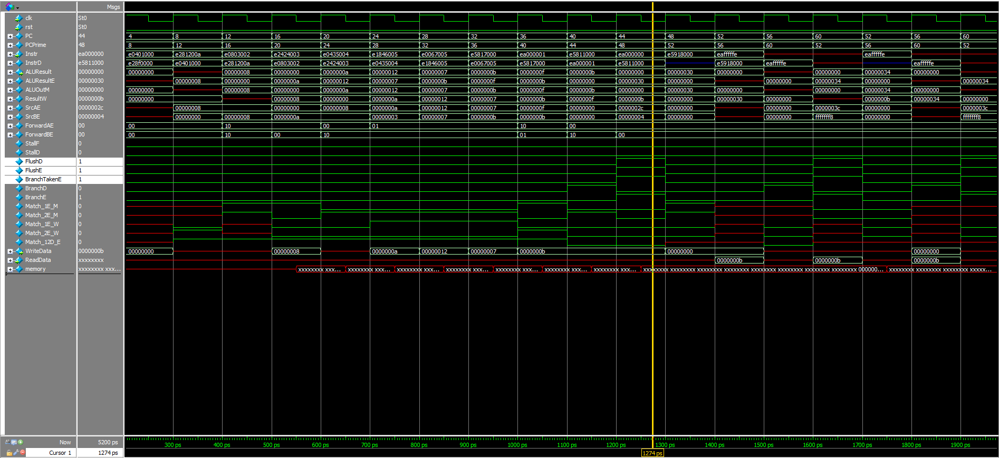
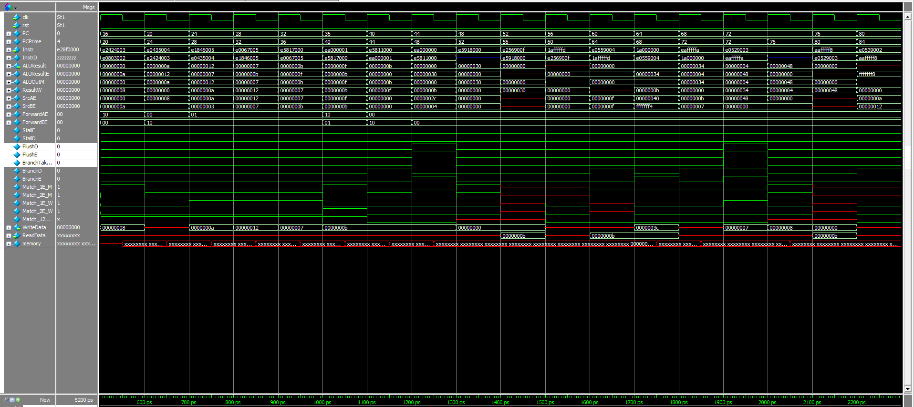
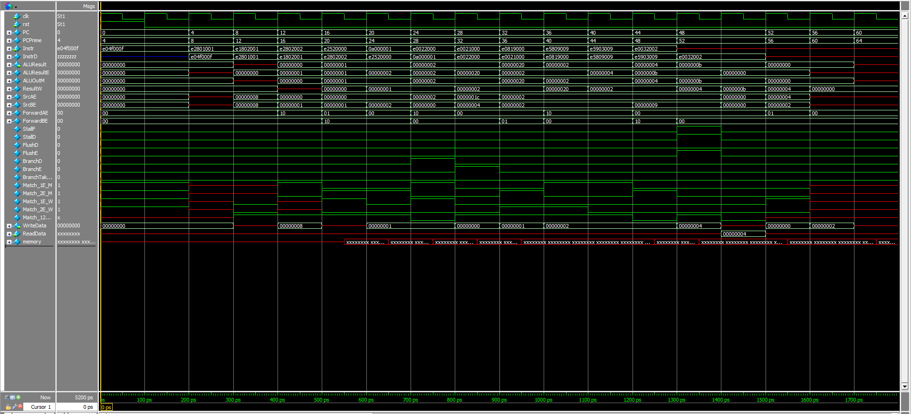

#ARM Pipelined Processor
This is a pipelined ARM single-cycle processor in SystemVerilog. It utilizes an ALU and a Register File.

##Testbench Results
Waveforms for the three programs are displayed below.

1. memfile1:

2. memfile2:

3. memfile3:

